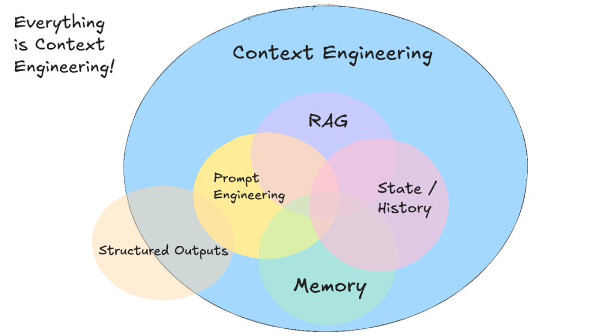

# Context Enginnering


طبق عکسی که پایین میبینید, همه چی مهندسی زمینه یا context engineering هست!



و راستش رو بخواین اگه همین رو یاد بگیرین بیشتر راه AI-powered engineer شدن رو رفتین :))

### Context Engineering چیه؟

«چه اطلاعاتی باید به مدل بدم که دقیقاً بفهمه من چی می‌خوام؟»

Context = prompt + اطلاعات زمینه‌ای + گفتگو های قبلی + ساختار گفتگو + فایل‌های باز شده + هدف نهایی شما
<div dir="rtl">
- توضیح دقیق تسک (چی می‌خوای؟ چرا؟ چطوری؟)
<br>
- فایل‌های مرتبط (کد اصلی، مثال، تست‌ها)
<br>
- ساختار کلی پروژه
<br>
- هدف اصلی فیچر یا باگی که داری هندل می‌کنی
<br>
- تعریف کردن PRD
<br>
- تعریف شفاف و کامل تسک و ساب تسک
</div>

### راه های منیج کردن کانتکست

#### - اضافه کردن PRD به context
یادتونه که PRD درست کردیم و اون رو تبدیل به تسک و ساب تسک کردیم؟
حالا دو تا فایل markdown درست میکنیم, یکی برای PRD و یکی برای تسک ها و ساب تسک ها
اولین پرامپتی که بهش میدیم اینه:
```
Check the whole structure of the project and the PRD.md file for PRD to get familiar with the goal and the big picture of it
```

### - اضافه کردن تسک و ساب تسک ها به context

بعد اون تسک هایی رو که از PRD درآورده بودیم رو paste میکنیم توی فایل tasks.md.
حالا برای انجام دادن تسک اول هر فایلی که مربوط به اون تسک میشه رو به context اضافه کنید.
بعد به ai agent میگیم که اولین تسک رو چک کنه و ساب تسک هاش رو دونه دونه انجام بده.

پرامپت:
‍‍
```
Now check tasks.md file and review the first task, do its subtasks one by one and check if they work correctly and as I intended
```


بعد از اینکه انجام شد, دقیق چک میکنیم که درست انجام داده یا نه
اگر نه, باید اون ساب تسک رو یه جور دیگه دیفاین کنیم و دوباره بهش بگیم. به این کار میگن **iterate کردن** که بعدا بیشتر راجع بهش صحبت میکنیم.

### - تعریف کردن و استفاده از قوانین کرسر [Cursor Rules](10-cursor-rules.md)
توی بخش قوانین کرسر توضیح دادم.

### نکته: مدیریت کردن چت

بعد از یه مدت که با ai agent چت میکنید متوجه میشید جواباش به درستی اون اوایل که ازش تسک میخواستید نیست. اینجا جاییه که اون داره هذیون گفتن رو شروع میکنه و context limit اش زده شده. باید حافظه اش رو تازه کنید و یه چت جدید باز کنید. این کار یکی از راه های context window management هست.

---

*بخش ۹ ->[مهندسی پرامپت](09-prompt-engineering.md)* 
